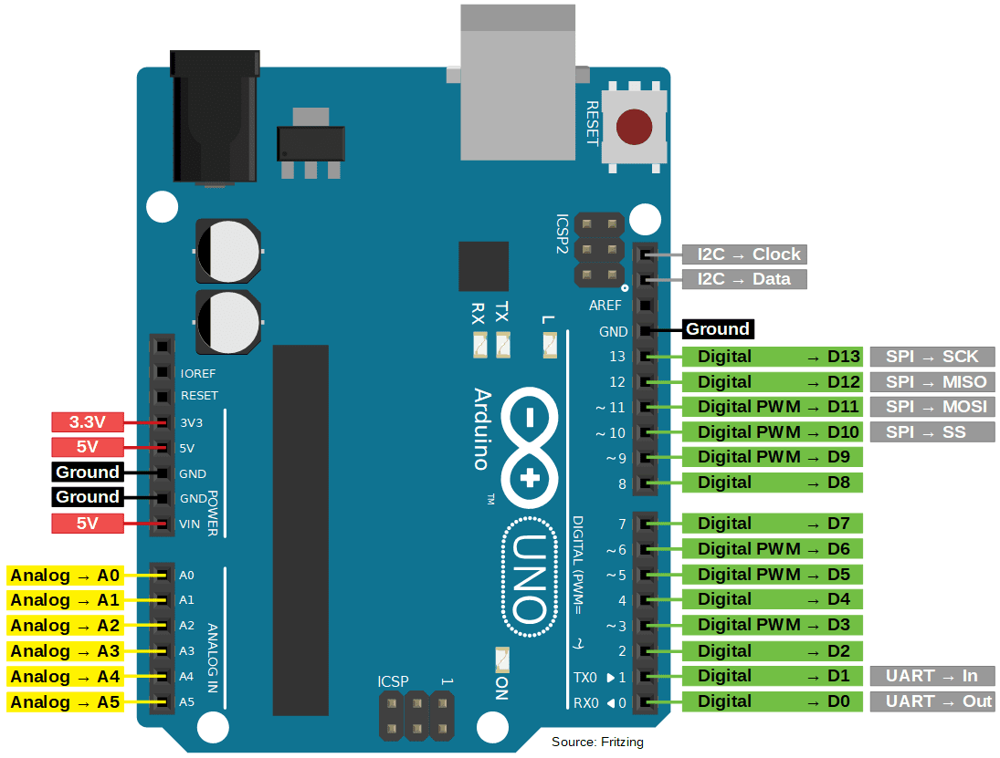
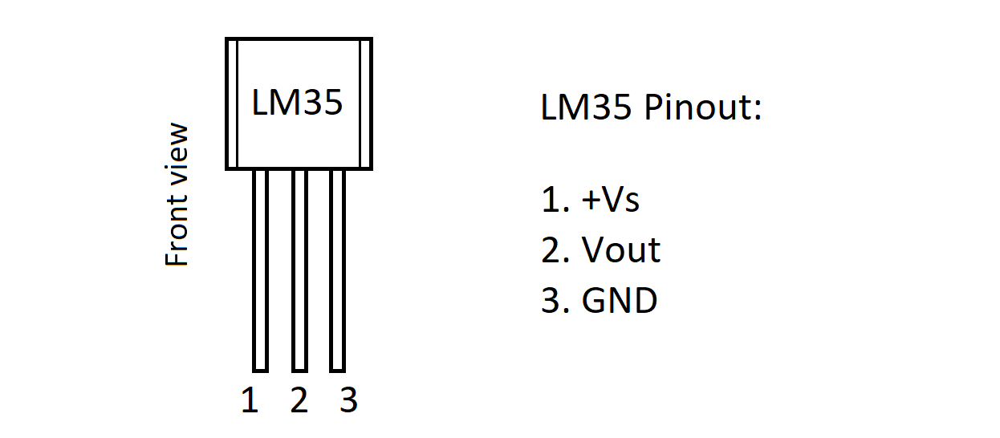

# Práctica 1: Introducción a los sensores y acondicionamiento de señal

##  🎯 Objetivo  
El alumno comprenderá las características eléctricas y de operación del sensor de temperatura, así como su aplicación en un **sistema de control ON/OFF de temperatura**. 

---

## 📝 Descripción  
Se diseñará un sistema para mantener la temperatura del aire **constante dentro de un pequeño contenedor**.  
- Para **incrementar** la temperatura se usará un **foco incandescente de 12 V (3–5 W)**.  
- Para **disminuir** la temperatura se usará un **ventilador de 12 V DC**.  
- El control será **ON/OFF con histéresis**, y la temperatura deseada se ingresará mediante una **interfaz web (Web Serial API)**.  

El sistema debe mantener la temperatura entre **30 y 50 °C** con un **error máximo de ±2 °C**.  

---

## 📂 Estructura  del repositorio  

```
temperature-chamber-controller/
│
├── firmware/          # Código Arduino (.ino)
├── web/               # Archivos de interfaz (HTML, CSS, JS)
├── images/            # Pinout
├── images_result/     # Imágenes de prueba
└── README.md          # Documentación principal
└── LICENSE          
```

---

## ⚙️ Requerimientos elegidos  
- **Sensor de temperatura:** LM35.  
- **Microcontrolador:** Arduino Uno R3.  
- **Etapa de potencia:** MOSFET N logic-level (para foco y ventilador).  
- **Interfaz de usuario:** Página web (HTML/CSS/JS) comunicada por Web Serial.  
- **Alimentación:** Fuente 12 V DC (≥2 A).  
- **Cables y salidas:** deben estar identificados en tres grupos:  
  1. Alimentación (12 V+/GND)  
  2. Control (D3 HEAT, D5 FAN, GND)  
  3. Sensor (5 V, Señal A0, GND)  

---

## 🧱 Componentes

### Arduino Uno R3
**Especificaciones clave**
- ADC 10 bits, referencia interna ~1.1 V.  
- Pines digitales a 5 V (40 mA máx. absoluto por pin; usa MOSFET para potencia).  
- UART por USB (115200 baudios).  

**Tarea**:  
Lee el LM35, ejecuta el control ON/OFF con histéresis, conmuta los MOSFET (calor/ventilación) y se comunica con la web (Web Serial).

**Conexiones**
- **A0** ⟶ salida del LM35 (señal).  
- **5V** ⟶ V+ del LM35.  
- **GND** ⟶ GND del LM35 y GND común con la fuente de 12 V.  
- **D3** ⟶ Gate MOSFET del foco (vía 220 Ω).  
- **D5** ⟶ Gate MOSFET del ventilador (vía 220 Ω).  
- **USB** ⟶ PC (alimentación/lógica y Web Serial).  

---

### Sensor de temperatura **LM35**
**Especificaciones clave**
- Salida **10 mV/°C** (lineal).  
- Alimentación 4–30 V (usaremos 5 V).  
- Precisión típica ±0.5 - 1.0 °C (cumple el ±2 °C de la práctica con calibración).  

**Tarea**:  
Medir la temperatura del aire dentro del contenedor.

**Conexiones**
- **PIN1 (Vs)** ⟶ 5V de Arduino.  
- **PIN2 (Vout)** ⟶ A0 de Arduino.  
- **PIN3 (GND)** ⟶ GND de Arduino.  
- **Capacitor**: 100 nF entre Vs y GND, junto al LM35.  

> [!IMPORTANT]
> **Ubicación**: en flujo de aire, lejos de la radiación directa del foco.

---

### MOSFET N logic-level (x2)
*(uno para foco “HEAT” y otro para ventilador “FAN”)*

**Modelos sugeridos**: IRLZ44N, FQP30N06L, IRLZ34N

**Especificaciones mínimas**
- **V_DS ≥ 30 V**  
- **I_D continuo ≥ 3 A**  
- **R_DS(on) ≤ 30 mΩ @ V_GS = 4.5–5 V**  

**Tarea**:  
Conmutar las cargas de 12 V por el lado bajo (low-side).

**Conexiones (por cada MOSFET)**
- **D (Drain)** ⟶ regresa desde la carga (foco/ventilador).  
- **S (Source)** ⟶ GND común (Arduino + 12 V).  
- **G (Gate)** ⟶ pin Arduino (D3 heat / D5 fan) vía 220 Ω; con pull-down 100 kΩ Gate→GND.  

**Notas**
- No requieren disipador a estas corrientes (≈0.5 A máx).  
- Mantener cables cortos en potencia y **GND común**.

> [!NOTE]
> ### ¿Qué significa que un MOSFET sea logic-level?

Que está diseñado para conducir completamente (bajo RDS(on)) con una tensión de compuerta (VGS) propia de la lógica de un microcontrolador, típicamente 5 V (y a veces 3.3 V).

Un MOSFET no logic-level normalmente necesita ≈10 V en la compuerta para encender “de verdad”.

### Por qué importa aquí

El Arduino entrega 5 V en el pin digital. Si el MOSFET no es logic-level:
- No saturará bien a 5 V → RDS(on) alto → caída de voltaje y calentamiento.
- Puede que la carga ni siquiera encienda correctamente.

### Atención en la hoja de datos

- RDS(on) especificado a VGS = 4.5–5 V (o 2.5 V si quieres compatibilidad 3.3 V).
    - Ej.: “RDS(on) = 25 mΩ @ VGS = 4.5 V”.

- NO te guíes por VGS(th) (umbral): es la tensión donde apenas pasan ~250 µA; no indica “encendido total”.

---

### Resistencias de Gate y Pull-down
**Especificaciones**
- Gate: **220 Ω** (entre pin de Arduino y Gate).  
- Pull-down: **100 kΩ** (Gate→GND).  

**Tarea**:  
Limitar pico de corriente de compuerta y evitar encendidos falsos al energizar.

---

### Diodo de protección para el ventilador (x1)
**Modelo sugerido**: 1N4007 (1 A, 1000 V, rectificador estándar).  

**Tarea**:  
Funciona como diodo de flyback, absorbiendo el pico de voltaje generado por la carga inductiva del ventilador al apagarse, protegiendo al MOSFET y al Arduino.  

**Conexión**:  
En paralelo al ventilador: **cátodo a +12 V**, **ánodo al nodo entre ventilador y Drain**.  

*(El foco es resistivo: no necesita diodo).*

**¿Qué es un diodo flyback?**

También llamado diodo de rueda libre o freewheel diode, es un diodo que se coloca en paralelo a una carga inductiva (motor, relé, solenoide) para darle camino a la corriente cuando el interruptor (el MOSFET) se apaga. Así absorbe el pico de voltaje que genera la inductancia y protege el transistor y al resto del circuito.

---

### Capacitores de desacoplo en 12 V
**Especificaciones**
- 100 µF / 25 V (electrolítico) cerca de las cargas.  
- 100 nF (cerámico) en paralelo.  

**Tarea**:  
Estabilizar el bus de 12 V y reducir EMI conmutada.

**¿Qué tarea realizan?**

- C2 = 100 µF (electrolítico, “bulk”)

**Función:** es un reservorio de energía. Cuando el ventilador arranca o el MOSFET conmuta, hay picos de corriente que pueden bajar el voltaje de 12 V momentáneamente.
El capacitor entrega corriente por unos milisegundos y recorta el hundimiento (sag) de la tensión.

**Frecuencia de trabajo:** eficaz en baja a media frecuencia (decenas de Hz a algunos kHz).

**Efecto práctico:** reduce parpadeos, resets raros y variaciones que podrían colarse al Arduino/sensor.

- C3 = 100 nF (cerámico, “HF”)

**Función:** es un atajo de baja impedancia para pulsos muy rápidos (alto dV/dt y dI/dt) generados por el conmutado del MOSFET y el motor.
“Corta” el ruido de alta frecuencia (EMI) y lo manda a tierra antes de que se propague por cables.

**Frecuencia de trabajo:** eficaz en alta frecuencia (de cientos de kHz a MHz).

**Efecto práctico:** la fuente y los cables “ven” menos ruido; el LM35 y el Arduino quedan más limpios.

> Juntos forman un filtro en paralelo: el capacitor de 100 µF se encarga de lo lento/grande y el de 100 nF de lo rápido/pequeño.
(Los electrolíticos tienen ESR/ESL mayores; por eso se acompaña con cerámico cercano).
> **ESR** — Equivalent Series Resistance / **ESL** — Equivalent Series Inductance

---

### Cargas
- **Foco 12 V, 3–5 W**  
  - Corriente: 0.25–0.42 A. **Resistivo**.  

- **Ventilador 12 V DC**  
  - Corriente: 0.1–0.3 A típico (pico de arranque mayor). **Inductivo** (lleva diodo).  

- **Conexión (ambas cargas, por separado)**
    - +12 V ⟶ Carga ⟶ Drain MOSFET ⟶ Source MOSFET ⟶ GND

---

### Fuente 12 V DC (≥ 2 A)
**Tarea**:  
Alimentar foco y ventilador con holgura.

**Conexión**
- **+12 V** a los extremos positivos de las cargas.  
- **GND 12 V** unido al GND del Arduino (**GND común indispensable**).

---

### Cableado y accesorios
- **Cables**: AWG-22 (o AWG-20) en potencia; jumpers para señal.  
- **Identificación**: 3 mazos rotulados como pide la práctica:  
  1. Alimentación (12 V+/GND)  
  2. Control (D3 HEAT, D5 FAN, GND)  
  3. Sensor (5 V, Señal A0, GND)  
- **Fijación**: porta-foco, rejilla del ventilador, prensaestopas para salidas de cables.  

---

## Conexiones — Resumen por pines

### Pinout Arduino 


### Arduino
| Pin Arduino | Conecta a | Nota |
|-------------|-----------|------|
| **5V** | Vs LM35 | Alimenta el sensor |
| **GND** | GND LM35 / GND MOSFETs / GND 12 V | Masa común |
| **A0** | Vout LM35 | Señal analógica |
| **D3** | Gate MOSFET HEAT (vía 220 Ω) | Control del foco |
| **D5** | Gate MOSFET FAN (vía 220 Ω) | Control del ventilador |
| **USB** | PC | Web Serial (UI) y/o alimentación |

Pull-downs: 100 kΩ Gate→GND (en D3 y D5).

---

### Pinout LM35



### LM35
| Pin LM35 | Conecta a |
|----------|-----------|
| 1 (Vs) | 5 V Arduino |
| 2 (Vout) | A0 Arduino |
| 3 (GND) | GND Arduino |
| + 100 nF | entre Vs y GND (cerca del LM35) |

---

### Pinout MOSFET IRFZ44N


### MOSFET HEAT (foco)
| Pin MOSFET | Conecta a |
|------------|-----------|
| **D** | Salida del foco (el otro lado del foco va a +12 V) |
| **S** | GND |
| **G** | D3 (vía 220 Ω) + 100 kΩ a GND |

*(sin diodo)*

---

### MOSFET FAN (ventilador)
| Pin MOSFET | Conecta a |
|------------|-----------|
| **D** | Salida del ventilador (el otro lado del ventilador va a +12 V) |
| **S** | GND |
| **G** | D5 (vía 220 Ω) + 100 kΩ a GND |
| **Diodo 1N4007** | Cátodo a +12 V / Ánodo al nodo Ventilador-D |

---

### Fuente 12 V
| Terminal | Conecta a |
|----------|-----------|
| **+12 V** | Lado positivo de foco y ventilador |
| **GND** | GND común (conectar a GND Arduino y Sources de MOSFET) |

---

## Esquemático ASCII

```
                           +12V DC (≥2A)
                              │
                              │
                    ┌─────────┴─────────┐
                    │                   │
                 [FOCO]              [VENTILADOR]
               (12V 3–5W)              (12V DC)
                    │                   │
                    │                   │
                    │                   │
                    │               ┌───┴───┐
                    │               │  D1   │  Diodo flyback 1N4007
                    │               │1N4007 │  (protege MOSFET del motor)
                    │               └───┬───┘
                    │                   │
                    │                   │
                    ▼                   ▼
                 (Nodo H)            (Nodo F)
                    │                   │
                 Drain QH           Drain QF
              ┌──────────┐       ┌──────────┐
              │  IRLZ44N │       │  IRLZ44N │     QH = MOSFET HEAT (foco)
              │   (QH)   │       │   (QF)   │     QF = MOSFET FAN  (ventilador)
              └─┬──────┬─┘       └─┬──────┬─┘
                │      │            │      │
              Source  Gate        Source  Gate
                │      │            │      │
                │     [R_GH]220Ω    │     [R_GF]220Ω     Resistencias de GATE
                │      │            │      │
                │      ├────► D3    │      ├────► D5      D3/D5 = pines Arduino
                │      │            │      │
                │     [R_PDH]100kΩ  │     [R_PDF]100kΩ   Pull-down Gate→GND
                │      │            │      │
                ├──────┴────────────┴──────┤
                │                          │
               GND ────────────────────────┘─────────────► GND Arduino / GND 12V (COMÚN)

Arduino UNO R3
 ┌──────────────────────────────┐
 │                              │
 │  A0 ◄─── LM35 OUT            │
 │  5V ────► LM35 Vs            │
 │  GND ───► LM35 GND           │
 │                              │
 │  D3 ───► Gate MOSFET HEAT    │
 │  D5 ───► Gate MOSFET FAN     │
 │                              │
 │  USB ──► PC (Web Serial)     │
 └──────────────────────────────┘

Notas:
- Resistencias 220 Ω entre D3/D5 y Gate de cada MOSFET.
- Pull-down 100 kΩ Gate → GND en cada MOSFET.
*- Condensador 100 nF en LM35 (Vs-GND).
*- Condensadores 100 µF + 100 nF en línea de 12 V.
- Diodo flyback: 1N4007 en el ventilador (cátodo a +12 V, ánodo al nodo Ventilador/Drain).
```

## 💻 Software  

### Arduino (firmware)  
- Lenguaje: **C++ (Arduino IDE)**.  
- Comunicación: **115200 baudios vía Serial USB**.  
- Funciones principales:  
  - Lectura del **LM35** (A0).  
  - Cálculo de la **temperatura en °C**.  
  - Control **ON/OFF con histéresis**.  
  - Conmutación de **D3 (foco/HEAT)** y **D5 (ventilador/FAN)**.  
  - Comunicación con la página web para mostrar/recibir datos.  

### Página Web (interfaz UI)  
- Archivos:  
  - `index.html` → estructura de la interfaz.  
  - `styles.css` → diseño visual.  
  - `app.js` → lógica de comunicación (Web Serial API).  
- Funciones principales:  
  - Permitir ingresar la **temperatura deseada**.  
  - Mostrar la **temperatura real** medida por el sensor.  
  - Mostrar en pantalla la **acción actual**: Calentando 🔥 / Enfriando ❄️.  

---

## ⚠️ Notas de seguridad  
- **Nunca conectar cargas de 127 V AC directo al MOSFET.** Este diseño está hecho para **12 V DC**.  
- Verificar que el **GND de la fuente de 12 V esté común** con el **GND del Arduino**.  
- Usar **diodo flyback (1N4007)** en paralelo con el ventilador para evitar daños por picos de voltaje.  
- Mantener buena ventilación y fijación de los componentes dentro del contenedor.  

---

## 🚀 Posibles mejoras  
- Reemplazar control ON/OFF por **control PID** para mayor estabilidad.  
- Agregar un **LCD 16x2 I2C** como interfaz alternativa.  
- Uso de un **módulo WiFi (ESP8266/ESP32)** para controlar y monitorear desde el celular.  
- Implementar **gráficas en la web** con historial de temperatura.  

---

## Créditos 

Created with ❤️ by [@luuuisc](https://github.com/luuuisc)